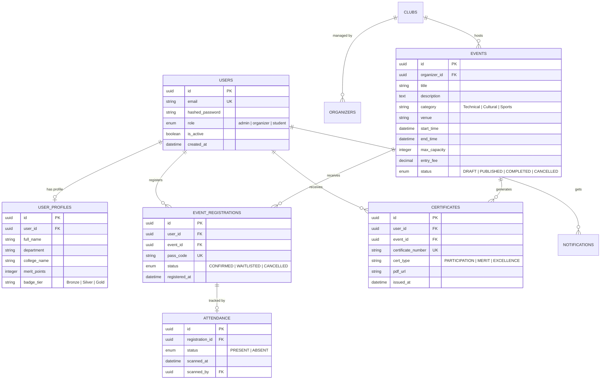

# 📘 CampusConnect Enterprise — Master Project Documentation

**Project Title:** CampusConnect: Enterprise Academic & Campus Event Operations System  
**Repository:** `dipali-more07/CampusConnect_team_Delta`  
**Live Production URL:** [https://campusconnectdelta.zapto.org](https://campusconnectdelta.zapto.org)  
**Super Admin Portal:** [https://campusconnectdelta.zapto.org/admin/dashboard](https://campusconnectdelta.zapto.org/admin/dashboard)  
**Version:** 2.4.0 (Enterprise Edition)  

---

## 📑 Table of Contents
1. [Executive Summary & Objectives](#1-executive-summary--objectives)
2. [Problem Statement & Market Gap](#2-problem-statement--market-gap)
3. [High-Level Architecture (HLD)](#3-high-level-architecture-hld)
4. [Low-Level Design (LLD) & Database Schema (3NF)](#4-low-level-design-lld--database-schema-3nf)
5. [End-to-End System Workflows & Sequence Diagrams](#5-end-to-end-system-workflows--sequence-diagrams)
6. [Complete REST API Specification](#6-complete-rest-api-specification)
7. [Camy AI Assistant (Autonomous RAG & Multilingual Voice)](#7-camy-ai-assistant-autonomous-rag--multilingual-voice)
8. [Automated PDF Certificate & QR Attendance Engine](#8-automated-pdf-certificate--qr-attendance-engine)
9. [Gamification & Student Engagement Model](#9-gamification--student-engagement-model)
10. [Security, Governance & OWASP Compliance (VAPT)](#10-security-governance--owasp-compliance-vapt)
11. [Deployment, Infrastructure & Operations Guide](#11-deployment-infrastructure--operations-guide)
12. [Technical Defense & Viva Examination Guide](#12-technical-defense--viva-examination-guide)

---

## 1. Executive Summary & Objectives

### 1.1 Overview
**CampusConnect** is a full-stack, enterprise-grade event operations and student credentialing platform tailored for universities, autonomous institutes, and colleges. Powered by a high-concurrency **FastAPI (Python 3.11)** microservices backend, **PostgreSQL 15** relational data engine, **Dockerized** infrastructure, and an autonomous **Retrieval-Augmented Generation (RAG) AI assistant (Camy AI)**, CampusConnect digitizes the entire lifecycle of academic, technical, and cultural events.

### 1.2 Core Objectives
- **100% Digital Event Lifecycle:** Eliminate manual paper registrations and Google Forms with 1-click digital pass ticketing.
- **Zero-Fraud Attendance Governance:** Eliminate proxy attendance using live 2D QR Code venue scanning.
- **Automated Certificate Dispatch:** Instant programmatic generation of high-resolution PDF certificates with vector styling and automated email delivery.
- **Autonomous Multilingual Support:** 24/7 AI-guided operations in Hindi, Marathi, and English with voice output.
- **Institutional Accreditation Metrics:** Real-time analytics and participation reports for NAAC, NBA, and NIRF audits.

---

## 2. Problem Statement & Market Gap

| Traditional Campus Event Operations | Friction & Risk | CampusConnect Enterprise Solution |
|---|---|---|
| **Registration** | Physical forms, cash receipts, fragmented spreadsheets | **1-Click Digital Event Passes** with instant validation |
| **Attendance** | Manual roll calls, high proxy attendance | **Live QR Code Check-in** at venue gates |
| **Certificates** | Manual printing & signatures, 2–4 weeks delay | **Automated Bulk PDF Generation** in under 3 seconds |
| **Student Engagement**| Passive attendance, no progression tracking | **Gamified Merit Badges** (Bronze, Silver, Gold Champion) |
| **Support & FAQs** | Overworked student coordinators, manual desks | **24/7 Camy AI Voice Assistant** with multilingual support |
| **Analytics & Audits**| Lost historical data, zero auditability | **Centralized Admin Dashboard** with real-time KPI graphs |

---

## 3. High-Level Architecture (HLD)

### 3.1 Layered Clean Architecture
CampusConnect follows a **3-Tier Layered Architecture** with strict separation of concerns:

```
┌─────────────────────────────────────────────────────────────┐
│                    Client Presentation Layer                │
│    (Web Portal / Mobile Browser / Admin Console UI)         │
└──────────────────────────────┬──────────────────────────────┘
                               │ HTTPS / JSON REST
                               ▼
┌─────────────────────────────────────────────────────────────┐
│               Reverse Proxy & Security Gateway              │
│       (Nginx + SSL Termination + Rate Limiter)              │
└──────────────────────────────┬──────────────────────────────┘
                               │ Reverse Proxy :5000
                               ▼
┌─────────────────────────────────────────────────────────────┐
│                   FastAPI Application Core                  │
│  ├─ Global Exception Handler & Middleware (CORS, Request ID)│
│  ├─ OAuth2 + JWT Role-Based Access Control (RBAC) Guard     │
│  └─ Pydantic v2 Request/Response Validation Layer           │
└──────────────┬───────────────────────────────┬──────────────┘
               │                               │
       ┌───────┴────────┐              ┌───────┴────────┐
       ▼                ▼              ▼                ▼
┌─────────────┐  ┌─────────────┐ ┌─────────────┐ ┌─────────────┐
│Auth Service │  │Event Service│ │Cert Service │ │ AI Service  │
│(JWT/Bcrypt) │  │ (Workflow)  │ │ (ReportLab) │ │(Gemini/Groq)│
└──────┬──────┘  └──────┬──────┘ └──────┬──────┘ └──────┬──────┘
       │                │               │               │
       └────────────────┼───────────────┴───────────────┘
                        ▼
┌─────────────────────────────────────────────────────────────┐
│          Repository & Data Access Layer (SQLAlchemy 2.0)    │
│              (Connection Pooling, ACID Transactions)        │
└──────────────────────────────┬──────────────────────────────┘
                               ▼
┌─────────────────────────────────────────────────────────────┐
│                PostgreSQL 15 Relational Database            │
│         (3NF Schema, Indexes, Foreign Key Constraints)      │
└─────────────────────────────────────────────────────────────┘
```

### 3.2 Technology Stack Justification
- **FastAPI (Python 3.11):** Chosen for native `async/await` asynchronous performance, Rust-powered Pydantic v2 serialization, and automatic OpenAPI (Swagger) generation.
- **PostgreSQL 15:** Chosen for ACID compliance, relational integrity (Foreign Keys), and enterprise concurrency.
- **SQLAlchemy 2.0:** Modern declarative ORM providing 100% protection against SQL Injection via parameterized queries.
- **ReportLab:** Pure Python PDF generation library used for exact coordinate geometry, vector graphics, and dynamic QR embedding.
- **Multi-Tier AI Fallback:** Gemini 3.5 Flash $\rightarrow$ Groq Llama 3.3 70B $\rightarrow$ Native Offline RAG Rule Engine.

---

## 4. Low-Level Design (LLD) & Database Schema (3NF)

### 4.1 Entity-Relationship (ER) Diagram (Mermaid)



### 4.2 Core Database Entities Summary
1. **`users` & `user_profiles`:** Auth credentials, roles, student department, accumulated gamification merit points, and current tier.
2. **`events`:** Event metadata, category, venue, dates, pricing, max seating capacity, and operational lifecycle state (`DRAFT` $\rightarrow$ `PUBLISHED` $\rightarrow$ `COMPLETED`).
3. **`event_registrations`:** Unique mapping between a student and an event with an auto-generated alphanumeric pass code.
4. **`attendance`:** Venue check-in audit record with timestamp and scanning organizer ID.
5. **`certificates`:** Generated credentials with unique certificate numbers and PDF storage path.

---

## 5. End-to-End System Workflows & Sequence Diagrams

### 5.1 Student Registration & Entry Pass Flow
```
Student              FastAPI Router          RegistrationService           PostgreSQL DB
   │                         │                         │                         │
   ├──1. POST /register ────>│                         │                         │
   │   (event_id, user_id)   ├──2. Validate Token ────>│ (Verify JWT Claims)     │
   │                         │                         ├──3. Check Capacity ────>│ (SELECT count)
   │                         │                         ├──4. Check Duplicate ───>│ (SELECT reg)
   │                         │                         ├──5. Create Registration>│ (INSERT record)
   │                         │                         │    (Generate Pass Code) │
   │<──6. 201 Created ───────┴─────────────────────────┘                         │
   │   (Return Digital Pass)
```

### 5.2 Live QR Attendance Check-In Flow
```
Organizer            FastAPI Router          AttendanceService             PostgreSQL DB
   │                         │                         │                         │
   ├──1. PUT /attendance ───>│                         │                         │
   │   (reg_id, status=PRES) ├──2. Verify Organizer ──>│ (Verify Role = Organizer)
   │                         │                         ├──3. Update Status ─────>│ (UPDATE status)
   │                         │                         ├──4. Award +50 Points ──>│ (UPDATE profile)
   │<──5. 200 OK Checked In ─┴─────────────────────────┘                         │
```

### 5.3 Automated Bulk Certificate Generation Flow
```
Organizer            FastAPI Router          CertificateService            ReportLab / DB
   │                         │                         │                         │
   ├──1. POST /complete ────>│                         │                         │
   │   (event_id)            ├──2. Set COMPLETED ─────>│                         │ (UPDATE event)
   │                         │   (Trigger Background)  ├──3. Query PRESENT users─>│ (SELECT users)
   │                         │                         ├──4. Generate PDF Canvas │ (Draw vector PDF)
   │                         │                         ├──5. Save Cert Record ───>│ (INSERT certs)
   │                         │                         ├──6. Dispatch Email ────>│ (SMTP Relay)
   │<──7. 200 OK Started ────┴─────────────────────────┘                         │
```

---

## 6. Complete REST API Specification

### 6.1 Authentication Endpoints (`/api/v1/auth`)
- `POST /api/v1/auth/register` — Create new student/organizer account.
- `POST /api/v1/auth/login` — Verify credentials & return OAuth2 Bearer JWT token.
- `GET /api/v1/auth/me` — Retrieve profile of currently authenticated user.

### 6.2 Event Management Endpoints (`/api/v1/events`)
- `GET /api/v1/events` — List all published events (supports filtering by category, status, search).
- `POST /api/v1/events` — Create new event (Organizer/Admin only).
- `GET /api/v1/events/{id}` — Retrieve full details of an event.
- `PUT /api/v1/events/{id}/complete` — Mark event as COMPLETED & trigger certificate engine.

### 6.3 Registration & Attendance Endpoints
- `POST /api/v1/registrations/event/{id}` — Student 1-click event registration.
- `GET /api/v1/registrations/my-registrations` — View user's registered events and digital passes.
- `PUT /api/v1/attendance/{reg_id}` — Update attendance state (`PRESENT` / `ABSENT`).

### 6.4 AI Assistant Endpoints (`/api/v1/ai`)
- `POST /api/v1/ai/chat` — Send query to Camy AI (multilingual text + voice intent).
- `GET /api/v1/ai/voice-config` — Retrieve synthesized speech parameters (language, pitch, rate).

### 6.5 Super Admin Analytics Endpoints (`/api/v1/analytics`)
- `GET /api/v1/analytics/dashboard` — Platform KPIs: Total Events, Registrations, Students, Organizers.
- `GET /api/v1/analytics/department-chart` — Department-wise participation breakdown for audit reports.

---

## 7. Camy AI Assistant (Autonomous RAG & Multilingual Voice)

### 7.1 Multi-Tier Fallback Architecture
To guarantee 99.99% availability without reliance on a single third-party provider, Camy AI uses a 3-tier fallback chain:

```
[ Incoming User Query ]
          │
          ▼
┌─────────────────────────┐
│ Input Sanitizer Guard   │  (Blocks prompt injection, SQLi, and jailbreaks)
└─────────┬───────────────┘
          │
          ▼
┌─────────────────────────┐
│ Tier 1: Google Gemini   │───[ Success ]───► [ Return Response ]
│    3.5 Flash Model      │
└─────────┬───────────────┘
          │ [ Error / Timeout / Rate Limit ]
          ▼
┌─────────────────────────┐
│ Tier 2: Groq Cloud      │───[ Success ]───► [ Return Response ]
│    Llama 3.3 70B Model  │
└─────────┬───────────────┘
          │ [ Network Down / Zero API Access ]
          ▼
┌─────────────────────────┐
│ Tier 3: Native RAG      │───[ Deterministic Offline ]───► [ Return Response ]
│   Rule & Knowledge Base │
└─────────────────────────┘
```

### 7.2 Multilingual Voice Synthesis
- **Auto-Detection:** Automatically detects incoming query language (Hindi, Marathi, Gujarati, English).
- **Voice Response:** Matches language with optimized Indian female accent speech synthesis configuration.
- **Autonomous Agent Actions:** Supports execution of actions (Event creation, navigation, certificate downloads) directly from chat.

---

## 8. Automated PDF Certificate & QR Attendance Engine

### 8.1 Eligibility Rules Engine
- **Rule 1 (Attendance Check):** A student MUST have attendance marked as `PRESENT`. Students with `ABSENT` or `CANCELLED` status are strictly excluded.
- **Rule 2 (Lifecycle Check):** The event status MUST be transitioned to `COMPLETED` before certificate compilation starts.

### 8.2 PDF Specifications
- **Dimensions:** Standard A4 Landscape ($297\text{ mm} \times 210\text{ mm}$).
- **Vector Rendering:** ReportLab canvas draws crisp geometric borders, institutional branding, student name, and digital seal.
- **Dynamic Content:** Injects student full name, event title, date of completion, rank/award type, and organizer signatures.

---

## 9. Gamification & Student Engagement Model

| Tier Badge | Points Required | Criteria | Rewards / Unlock |
|---|---|---|---|
| 🥉 **Bronze Achiever** | 0 – 99 pts | Initial platform signup & 1 event | Basic profile badge |
| 🥈 **Silver Performer** | 100 – 499 pts | 2+ event attendances | Priority registration pass |
| 🥇 **Gold Champion** | 500+ pts | 5+ events attended or top rankers | Institutional Wall of Fame |

- **Points Allocation:**
  - Event Participation (`PRESENT`): **+50 Points**
  - Merit Winner (1st, 2nd, 3rd Rank): **+100 Points**
  - Special Excellence Award: **+150 Points**

---

## 10. Security, Governance & OWASP Compliance (VAPT)

- **SQL Injection Shield:** 100% parameterized queries via SQLAlchemy 2.0 ORM; zero concatenated raw SQL strings.
- **Prompt Injection Defense:** Strict input sanitization in `ai_service.py` rejecting jailbreak tokens (e.g., `"ignore previous instructions"`, `"DAN mode"`).
- **Role-Based Access Control (RBAC):** Token dependency guards (`require_role(["admin"])`) blocking unauthorized student access to admin/organizer APIs.
- **Cryptographic Security:** Passwords hashed with **Bcrypt (cost factor 12)**; stateless **OAuth2 JWT** tokens with HMAC-SHA256 signatures.
- **XSS & Payload Stripping:** Pydantic validators strip script tags, iframes, and enforce a 1,000-character max query limit.

---

## 11. Deployment, Infrastructure & Operations Guide

### 11.1 Production Deployment (Docker Compose)
```bash
# 1. Clone the repository
git clone https://github.com/dipali-more07/CampusConnect_team_Delta.git
cd CampusConnect_team_Delta/backend

# 2. Configure production environment variables (.env)
cat <<EOF > .env
PROJECT_NAME="CampusConnect Enterprise"
PORT=5000
DATABASE_URL=postgresql://postgres:password@db:5432/campusconnect
GEMINI_API_KEY=your_gemini_api_key
MAIL_SERVER=127.0.0.1
MAIL_PORT=25
MAIL_FROM=noreply@campusconnect.com
EOF

# 3. Launch containerized services
docker-compose up -d --build
```

### 11.2 Nginx Reverse Proxy Configuration
Nginx handles SSL termination, forwards traffic to port `5000`, and sets security headers (`X-Frame-Options`, `X-Content-Type-Options`).

---

## 12. Technical Defense & Viva Examination Guide

1. **Q: Why did you choose FastAPI over Django or Flask?**  
   *Ans:* FastAPI is built on ASGI (Starlette) providing native asynchronous concurrency (`async/await`), outperforming Flask by ~300% in I/O bound operations. Unlike Django, it is lightweight, microservice-friendly, and provides automatic Rust-based Pydantic v2 data validation and Swagger UI documentation.

2. **Q: How does the system prevent proxy attendance?**  
   *Ans:* Each registered student receives a unique digital pass. At the venue, the organizer scans the student's entry pass in real time to mark them `PRESENT`. Unattended passes remain unverified, disqualifying those students from receiving certificates.

3. **Q: What happens if Gemini API experiences an outage during an event?**  
   *Ans:* CampusConnect implements a 3-tier fallback chain. If Gemini fails or times out, the system automatically falls back to Groq Cloud (Llama 3.3 70B). If internet access is completely disrupted, the offline Native RAG engine serves deterministic rule-based responses.

4. **Q: How are certificates protected from tampering?**  
   *Ans:* Every certificate is generated programmatically on the server with a unique cryptographic certificate number, immutable student metadata, and stored securely in read-only digital storage.

---
*End of Master Technical Documentation · CampusConnect Enterprise 2026*
